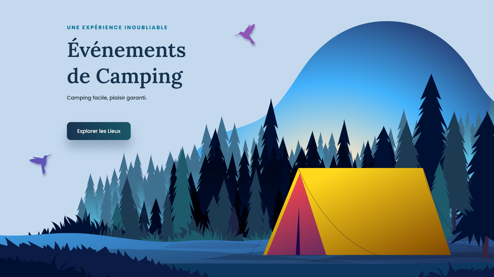

<div align="center">  
  <a href="https://background-animation-camping.netlify.app/" target="_blank">  
      
  </a>  
  </br></br>  
  <h3 align="center">🏕️ Animation de Fond &nbsp;–&nbsp; Événements Camping</h3>  
</div>

## <br /> 📌 Sommaire

&nbsp;&nbsp;&nbsp; 🎨 &nbsp; [**Introduction**](#introduction)<br />
&nbsp;&nbsp;&nbsp; 🛠️ &nbsp; [**Technologies**](#technologies)<br />
&nbsp;&nbsp;&nbsp; 🎯 &nbsp; [**Fonctionnalités**](#fonctionnalités)<br />
&nbsp;&nbsp;&nbsp; 🚀 &nbsp; [**Installation**](#installation)<br />

## <br /> <a name="introduction">🎨 Introduction</a>

Landing page immersive sur le thème du camping, alliant animations **GSAP**, éléments visuels dynamiques et design naturel. L’interface responsive s’adapte à tous les écrans pour une expérience fluide et moderne.

Idéale pour mettre en valeur des lieux ou événements liés au camping, chaque section évoque l’esprit plein air à travers des visuels forestiers et des animations subtiles.

## <br /> <a name="technologies">🛠️ Technologies</a>

- HTML5 sémantique et accessible
- CSS3 moderne avec variables, media queries et animations
- JavaScript ES6 clair et modulaire
- [GSAP](https://greensock.com/gsap/) pour les animations fluides
- [Remix Icons](https://remixicon.com/) pour les icônes vectorielles

## <br /> <a name="fonctionnalités">🎯 Fonctionnalités</a>

- Animations GSAP sur les éléments clés
- Effet d’apparition fluide et séquentiel
- Blocs visuels superposés et positionnés dynamiquement
- Menu responsive avec bouton toggle
- Scroll header animé via une ombre dynamique
- Boutons Connexion et Inscription animés
- Design responsive 100% mobile-first
- Navigation fluide vers les sections

## <br /> <a name="installation">🚀 Installation</a>

### ✅ Prérequis

- [Google Chrome](https://www.google.com/) — Navigateur moderne
- [Visual Studio Code](https://code.visualstudio.com/) — Éditeur de code
- [Live Server](https://marketplace.visualstudio.com/items?itemName=ritwickdey.LiveServer) — Extension VS Code

### 📥 Cloner le projet

```bash
git clone https://github.com/ValentinMadiot/background-animation-camping_js
cd background-animation-camping_js
```

### ▶️ Lancer le projet

Il suffit d’ouvrir le fichier `index.html` dans un navigateur, ou d’utiliser l’extension **Live Server** sur VS Code pour un aperçu dynamique.
